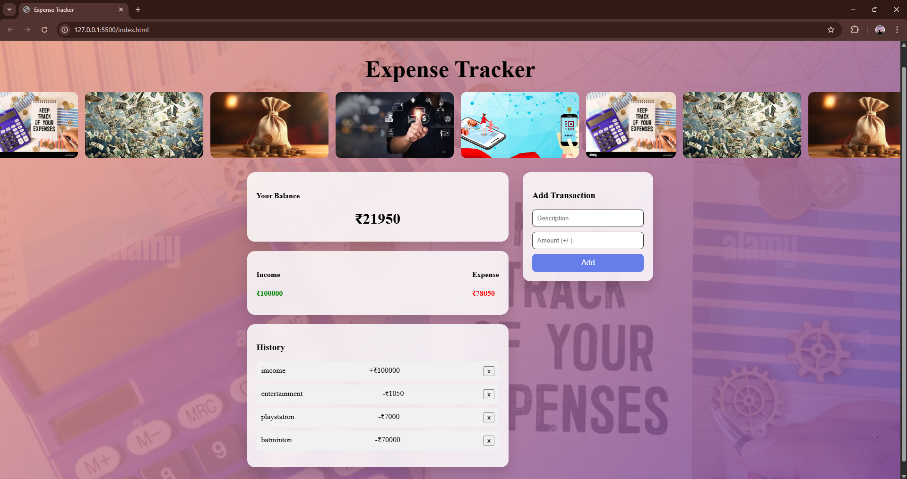
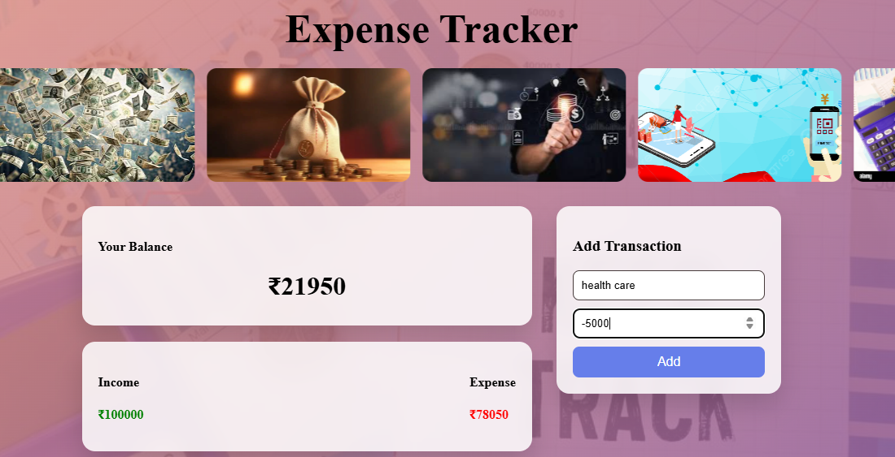
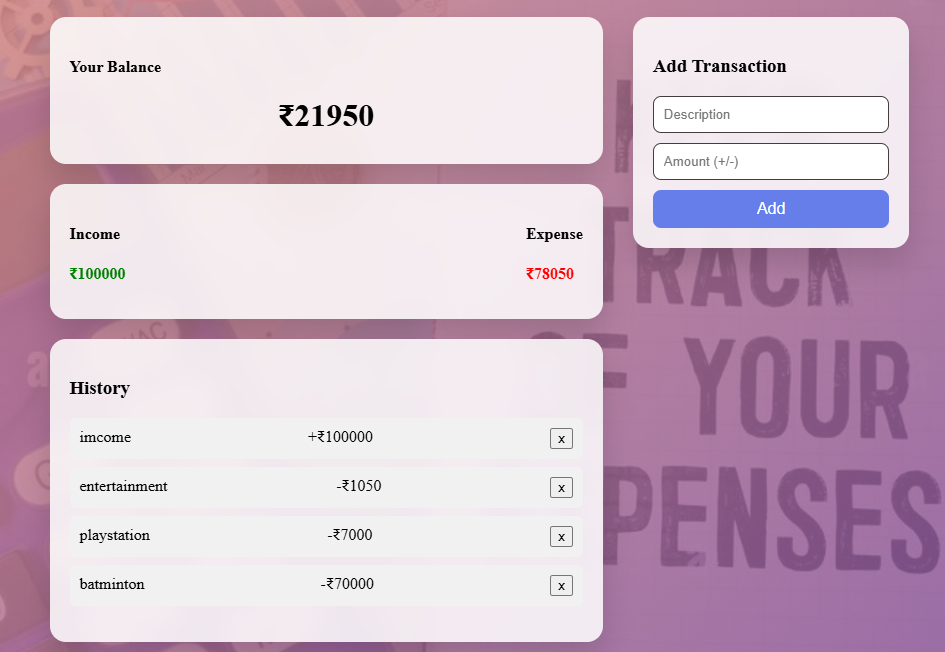

# 💰 Expense Tracker Web App

A responsive and user-friendly **Expense Tracker** web application that helps users manage their income and expenses efficiently. The app provides a modern dashboard UI, real-time balance calculation, transaction history, and persistent storage using browser LocalStorage.

---

## 🚀 Features

- ➕ Add income and expense transactions  
- 💵 Real-time balance calculation  
- 📊 Separate income and expense summary  
- 🗂 Transaction history with delete option  
- 💾 Data persistence using LocalStorage  
- 📱 Fully responsive (Mobile, Tablet, Desktop)  
- 🎨 Modern UI with background images & glassmorphism cards  
- 🎞 Continuous image slider banner  

---

## 🛠 Tech Stack

- **HTML5** – Structure  
- **CSS3** – Styling, Grid, Flexbox, Responsive Design  
- **JavaScript (ES6)** – Logic & DOM manipulation  
- **LocalStorage** – Data persistence  

---

## 📸 Screenshots

> (Add screenshots of your project here)

